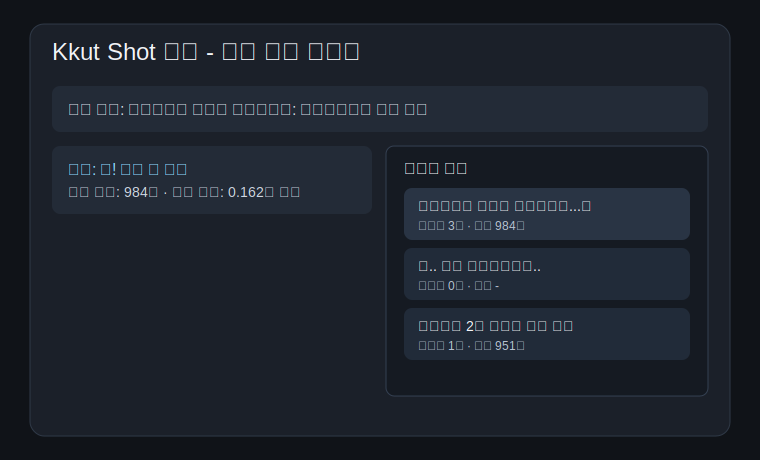
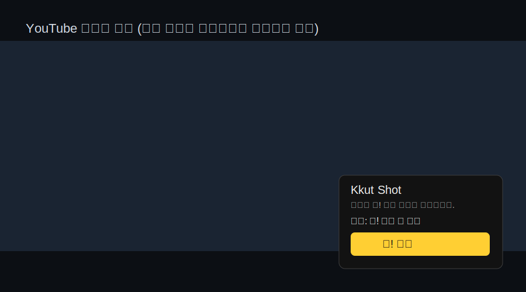

# 무비띵크 끝 샷!

YouTube 영상에서 `끝!` 타이밍을 맞추는 Chrome 확장 프로그램입니다.

## 사용자 설치 방식 (Git 클론 불필요)

이제 전체 저장소를 클론하지 않고, **확장 프로그램 전용 ZIP**만 받아서 설치합니다.

1. `kkut-shot-extension.zip` 다운로드
2. 원하는 폴더에 압축 해제
3. Chrome `chrome://extensions` 열기
4. Developer mode ON
5. `Load unpacked` 클릭
6. 압축 해제한 폴더 선택

기본 정답 데이터 URL:

```text
https://raw.githubusercontent.com/redplug/chrome-ext-kkut-shot/main/data/answers.json
```

## 현재 동작 규칙

- 정답이 등록된 영상에서만 오버레이가 표시됩니다.
- 정답 시각은 `끝! 찍기` 버튼을 누르기 전까지 공개되지 않습니다.
- 팝업을 열면 정답 데이터가 자동 새로고침됩니다.
- 팝업의 등록 영상 리스트를 클릭하면 해당 유튜브 영상으로 바로 이동합니다.
- 플레이 기록/최고 점수는 서버가 아니라 로컬 Chrome 저장소(`chrome.storage.local`)에 저장됩니다.

## 기능 화면 예시

팝업(등록 영상 리스트, 최고 점수, 기록):



오버레이(정답 비공개 상태):



## 운영자(정답 갱신)용

### 맥미니 분석기 실행

```bash
cp config/channels.example.json config/channels.json
# channels.json에서 channelId/captureSeconds/maxVideosPerRun 설정

./scripts/setup_macmini.sh
source .venv/bin/activate
python scripts/update_answers.py --commit --push
```

### 확장 프로그램 ZIP 만들기

```bash
./scripts/package_extension.sh
```

생성 파일:

- `build/kkut-shot-extension.zip`

이 ZIP을 사용자에게 배포하면 됩니다.
